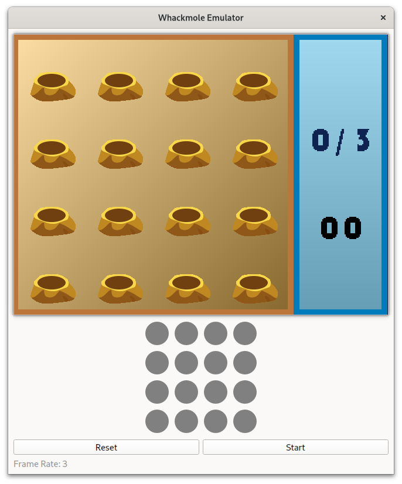

# Whackamole
## Table of Contents

- [Whackamole](#whackamole)
  - [Table of Contents](#table-of-contents)
  - [About ](#about-)
  - [Getting Started ](#getting-started-)
    - [Prerequisites](#prerequisites)
    - [Verilog Generation \& Simulation](#verilog-generation--simulation)
    - [On-board Validation](#on-board-validation)

## About <a name="about"></a>

The Whackamole project is a Whack-a-Mole game implemented using SpinalHDL for RTL (Register Transfer Level) development, Verilator for simulation, and Qt for visualization. This project serves as the final course project for ASIC2023.



## Getting Started <a name="getting-started"></a>

These instructions will guide you through setting up the project on your local machine for development and testing purposes. 

### Prerequisites

You need to install the following dependencies for simulation:

- Verilator
- Qt6

Also, you need to install *sbt* for generating the Verilog code from SpinalHDL.

Please follow the installation instructions provided by the respective projects to install these dependencies on your system.

### Verilog Generation & Simulation

To run the simulation, follow these steps:

1. Clone the repository:

   ```
   git clone https://github.com/0xtaruhi/Whackamole.git
   ```

2. Change into the project directory:

   ```
   cd whackamole
   ```

3. Generate the Verilog code:

   ```
   sbt "runMain whackamole.EmitVerilog"
   ```

   This will generate the Verilog code in the `rtl/verilog` directory. This directory already contains some Verilog files that are not generated by SpinalHDL. You can ignore them. Btw, these files are used for on-board validation, 
   you may need to replace some of them with your own files if you want to validate the design on your own board.

   The `GameTop.v` is the top-level module of the design, 
   and the `BoardTop.v` is the top-level module for on-board validation. You can instantiate the `GameTop` module in your own top-level module. It uses VGA for display.

4. Build the simulation project:

   ```
   mkdir build
   cmake ..
   make -j{number of threads}
   ```

   Remember to replace `{number of threads}` with the number of threads you want to use for building the project.

   **DO NOT** use Ninja for building the project. Ninja may not work properly with Verilator.and Qt.

5. Run the simulation:

   ```
   sim/sim
   ```

   This will start the Whack-a-Mole simulation.

### On-board Validation

We will use Procise as the EDA (Electronic Design Automation) tool for FPGA development to generate the bitstream and download it onto the FPGA development board. 

Here we do not provide the Procise project files including the constraints file. So here we don't provide detailed instructions nor explanations.